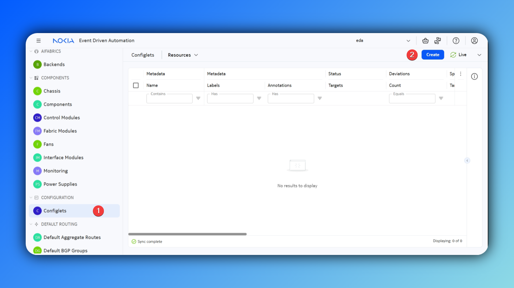
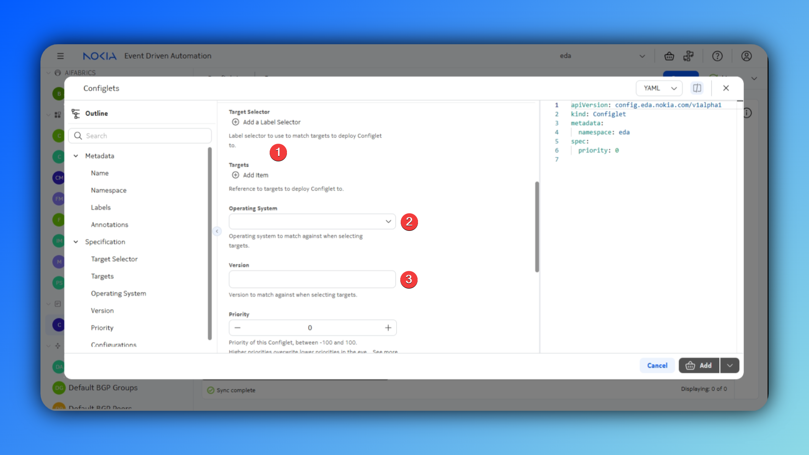

# Unequal ECMP for EVPN IP prefix routes

<script type="text/javascript" src="https://viewer.diagrams.net/js/viewer-static.min.js" async></script>
-{}-

|                       |                                                                                              |
| --------------------- | -------------------------------------------------------------------------------------------- |
| **Short Description** | Enable Unequal ECMP for anycast BGP PE-CE routes              |
| **Difficulty**        | Intermediate                                                                                     |
| **Topology Nodes**    | :material-server: client1, :material-server: client3, :material-server: client4, :material-server: client5, :material-router: leaf1, :material-router: leaf3, :material-router: borderleaf1, :material-router: borderleaf2           |
| **References**    |   [SR Linux documentation](https://documentation.nokia.com/srlinux/25-10/books/vpn-services/evpn-vxlan-tunnels-layer-3.html#unequal_ecmp_for_evpn_ip_prefix_routes){:target="_blank"}         |


## Objective

In this activity, you will deploy a virtual network with BGP PE-CE edge connectivity to the clients that are running FRR. The clients on the leaf side are advertising the 1.1.1.0/24 subnet into the L3 service. This can be seen as an anycast services network. Leaf1 has a single path to the network, while leaf3 has 2. In normal operation, the borderleafs will load-balance evenly to leaf1 and leaf3. To ensure equal load-balancing on the edge interfaces, instead of across VTEPs, we can enable EVPN with weighted ECMP.

## Technology explanation

SR Linux supports weighted Equal Cost Multi Path (ECMP) for EVPN IP prefix IFL (interface-less) routes for EVPN-VXLAN and EVPN-MPLS services. To do this, SR Linux makes use of the EVPN link-bandwidth extended community (EC) defined in [draft-ietf-bess-evpn-unequal-lb](https://datatracker.ietf.org/doc/draft-ietf-bess-evpn-unequal-lb){:target="_blank"}. This extended community indicates the weight for a specific IP prefix; that is, the number of PE-CE multi-paths for an IP prefix that is re-advertised into an EVPN IP prefix route.

[EVPN using weighted ECMP](#evpn-weighted-ecmp) shows an example of weighted ECMP. Assuming each Container Network Function (CNF) advertises the anycast subnet 1.1.1.0/24 from a different next-hop, each leaf ends up with a different number of multi-paths in its PE-CE session. In the example below, leaf3 has 2 multi-paths for the anycast subnet, and the advertised EVPN IP prefix route includes an EVPN link-bandwidth extended community with a weight of 2. Leaf1 sends a weight of 1.

On the border leafs / data center gateways, when this feature is enabled, if the EVPN IP prefix route has an Ethernet Segment Identifier (ESI) of 0, the PE sprays the flows to the EVPN IP prefix route based on the received weight; in this example, one-third of the flows are sent to Leaf1, and two-thirds are sent to Leaf3.

<a id="evpn-weighted-ecmp"></a>
-{{ diagram_file(path='../images/eda.drawio', title='EVPN using weighted ECMP', page=10, zoom=1.5) }}-

<!-- Remove?
When the EVPN IP prefix route has a non-zero ESI, and there is a weight in the route:

- The EVPN link-bandwidth extended community received in the EVPN IP prefix route indicates the weight for the EVPN IP prefix route.
- The PE sprays the flows to the EVPN IP prefix route based on the received weight, dividing the flows to an ES among the number of PEs attached to the ES.
- In the example above, one-fifth of the flows are sent to the aliased pair TOR1/TOR2 (either one is selected because TOR1 and TOR2 are attached to the same Ethernet Segment).
- The system rounds up when the advertised weight for the IP Prefix is a non-zero ESI, divided by the number of PEs in the ES, is not an integer.
- For example, if ES1 (TOR1/TOR2) advertises BW=3 on the IP Prefix route, and TOR4 advertises BW=1, then 3 (BW) / 2 (PE in ES1) = 1.5. The system rounds up, and the remote nodes install weight=2 for TOR1, weight=2 for TOR2, and weight=1 for TOR4.
- If the weight received in a non-zero ESI IP prefix route exceeds 128, the system caps it at 128, then divides the weight into the number of PEs in the ES.
- If two EVPN IP prefix routes are received for the same prefix, same ESI, different route distinguishers (RDs), they should have the same weight. However, if they have different weights, the system selects the weight from the first EVPN IP prefix route.
- If the EVPN link-bandwidth extended community is missing from any of the PEs in an ECMP set, or the Value Units field of the extended community is inconsistent, the weight is ignored by the receiving PE, and regular ECMP forwarding is performed. The Value Units field can indicate "bandwidth" or a "generalized weight", with only the latter being supported by SR Linux.
End Remove? -->

## Tasks

### Create the Virtual Network with BGP PE-CE edge connectivity

<a id="service-arch"></a>
-{{ diagram_file(path='../images/eda.drawio', title='Unequal ECMP service architecture', page=11, zoom=1.5) }}-

Before enabling weighted ECMP, we will deploy the service used for this use-case. Deploy the [Unequal ECMP service architecture](#service-arch) using the -{{icons.circle(letter="VN", text="Virtual Networks")}}- resource. 

Use the knowledge you gained during the exercise [Virtual Networks](../overlay/virtual-networks.md){:target="_blank"}.

In a single virtual network resource you will be able to define:

- a **Router** to create the IP-VRF of the EVPNVXLAN type
- five **Routed Interfaces** to connect the Router to the `client1`, `client3`, `client4` and `client5` over the VLAN 400
- two **BGP Groups** where you specify the used `Routing Policies`, address families and AS numbers
- five **BGP Peers** that reference a `Routed Interface`, inherit properties from a `BGP Group`, and where you define the peer IP address

/// Note

Hosts `client1`, `client3` and `client4` are running BGP with ASN 65554. Host `client5` is running BGP with ASN 65556.

///

/// details | Hint
    type: tip

In this lab environment, for simplicity, we can use the `accept-all` routing policy.

///

/// details | Solution
    type: success

```yaml
apiVersion: services.eda.nokia.com/v1
kind: VirtualNetwork
metadata:
  name: vrf1
  namespace: eda
spec:
  protocols:
    bgp:
      bgpGroups:
        - name: bgp-group-cnf
          spec:
            exportPolicy:
              - accept-all
            importPolicy:
              - accept-all
            ipv4Unicast:
              enabled: true
            localAS:
              autonomousSystem: 65555
            peerAS:
              autonomousSystem: 65554
        - name: bgp-group-pe
          spec:
            exportPolicy:
              - accept-all
            importPolicy:
              - accept-all
            ipv4Unicast:
              enabled: true
            localAS:
              autonomousSystem: 65555
            peerAS:
              autonomousSystem: 65556
      bgpPeers:
        - name: cnf1
          spec:
            dynamicNeighbor: false
            group: bgp-group-cnf
            interface: vrf1-routed-interface-client1
            interfaceKind: ROUTEDINTERFACE
            peerIP: 10.40.1.1
        - name: cnf3
          spec:
            dynamicNeighbor: false
            group: bgp-group-cnf
            interface: vrf1-routed-interface-client3
            interfaceKind: ROUTEDINTERFACE
            peerIP: 10.40.3.1
        - name: cnf4
          spec:
            dynamicNeighbor: false
            group: bgp-group-cnf
            interface: vrf1-routed-interface-client4
            interfaceKind: ROUTEDINTERFACE
            peerIP: 10.40.4.1
        - name: pe5-1
          spec:
            dynamicNeighbor: false
            group: bgp-group-pe
            interface: vrf1-routed-interface-bleaf1-client5
            interfaceKind: ROUTEDINTERFACE
            peerIP: 20.40.1.1
        - name: pe5-2
          spec:
            dynamicNeighbor: false
            group: bgp-group-pe
            interface: vrf1-routed-interface-bleaf2-client5
            interfaceKind: ROUTEDINTERFACE
            peerIP: 20.40.2.1
  routedInterfaces:
    - name: vrf1-routed-interface-client1
      spec:
        arpTimeout: 14400
        interface: leaf1-client1
        ipMTU: 1500
        ipv4Addresses:
          - ipPrefix: 10.40.1.0/31
        learnUnsolicited: NONE
        router: router-vrf1
        vlanID: '400'
        vlanPool: vlan-pool
    - name: vrf1-routed-interface-client3
      spec:
        arpTimeout: 14400
        interface: leaf3-client3
        ipMTU: 1500
        ipv4Addresses:
          - ipPrefix: 10.40.3.0/31
        learnUnsolicited: NONE
        router: router-vrf1
        vlanID: '400'
        vlanPool: vlan-pool
    - name: vrf1-routed-interface-client4
      spec:
        arpTimeout: 14400
        interface: leaf3-client4
        ipMTU: 1500
        ipv4Addresses:
          - ipPrefix: 10.40.4.0/31
        learnUnsolicited: NONE
        router: router-vrf1
        vlanID: '400'
        vlanPool: vlan-pool
    - name: vrf1-routed-interface-bleaf1-client5
      spec:
        arpTimeout: 14400
        interface: borderleaf1-ethernet-1-1
        ipMTU: 1500
        ipv4Addresses:
          - ipPrefix: 20.40.1.0/31
        learnUnsolicited: NONE
        router: router-vrf1
        vlanID: '400'
        vlanPool: vlan-pool
    - name: vrf1-routed-interface-bleaf2-client5
      spec:
        arpTimeout: 14400
        interface: borderleaf2-ethernet-1-1
        ipMTU: 1500
        ipv4Addresses:
          - ipPrefix: 20.40.2.0/31
        learnUnsolicited: NONE
        router: router-vrf1
        vlanID: '400'
        vlanPool: vlan-pool
  routers:
    - name: router-vrf1
      spec:
        bgp:
          autonomousSystem: 65555
          ebgpPreference: 170
          enabled: true
          ibgpPreference: 170
          ipv4Unicast:
            enabled: true
            multipath:
              allowMultipleAS: true
              maxAllowedPaths: 64
          minWaitToAdvertise: 0
          rapidWithdrawl: true
          waitForFIBInstall: false
        eviPool: evi-pool
        tunnelIndexPool: tunnel-index-pool
        type: EVPNVXLAN
        vniPool: vni-pool
```
///

### Validate ECMP traffic load-balancing

#### Grafana Dashboard


#### Custom EDA Dashboard


### Enable Unequal ECMP for EVPN IP prefix routes

From the [SR Linux documentation](https://documentation.nokia.com/srlinux/25-10/books/vpn-services/evpn-vxlan-tunnels-layer-3.html#unequal_ecmp_for_evpn_ip_prefix_routes){:target="_blank"}, we can see that we require some configuration in the BGP Peer context and the `bgp-evpn` context, to enable weighted EVPN ECMP for PE-CE BGP routes.

To achieve this we need to configure the following on `leaf1` and `leaf3`:

1. Enable advertisements of the EVPN link bandwidth extended community:
```srl
network-instance router-vrf1 {
    protocols {
        bgp-evpn {
            bgp-instance 1 {
                routes {
                    route-table {
                        ip-prefix {
                            evpn-link-bandwidth {
                                advertise {
                                }
                            }
                        }
                    }
                }
            }
        }
    }
}
```
2. Configure a weight to be internally added to the received PE-CE BGP routes:
```srl
network-instance router-vrf1 {
    protocols {
        bgp {
            group bgp-group-cnf {
                afi-safi ipv4-unicast {
                    ipv4-unicast {
                        link-bandwidth {
                            add-next-hop-count-to-received-bgp-routes 1
                        }
                    }
                }
            }
        }
    }
}
```

Similarly, we need to enable weighted ECMP on the borderleafs. When weighted ECMP is enabled, the system takes into account the EVPN link-bandwidth extended community when installing an ECMP set for an EVPN IP prefix route in the IP-VRF route table.

```srl
network-instance router-vrf1 {
    protocols {
        bgp-evpn {
            bgp-instance 1 {
                routes {
                    route-table {
                        ip-prefix {
                            evpn-link-bandwidth {
                                weighted-ecmp {
                                    admin-state enable
                                    max-ecmp-hash-buckets-per-next-hop-group 4
                                }
                            }
                        }
                    }
                }
            }
        }
    }
}
```

Off course, we will not log into every single node and configure this manually. With EDA, you can use `Configlets` to configure anything that is not covered by intents.

Translate these config snippets into EDA `Configlets` to easily deploy this configuration on multiple nodes. To achiieve this, the steps involve:

1. Navigate to the Configlets resource and create a new resource 
2. Select your target nodes using a label or reference them directly. Specify the NOS and version. 
3. Specify your configlet details, this includes the `YANG` path in `jspath` notation, and the node configuration in JSON formatting. 

/// details | Hint
    type: tip

To easily retrieve the jspath and configuration, you can log into a node and push your required configuration. Next, you can use the command `pwc jspath` to retrieve the current working context in jspath format. Finally, you can retrieve the configuration in JSON format using the command `info | as json`
///

/// details | Solution
    type: success

=== "EVPN Link Bandwidth Advertise"
    ```yaml
    apiVersion: config.eda.nokia.com/v1alpha1
    kind: Configlet
    metadata:
      name: router-vrf1-evpn-link-bandwidth-advertise
      namespace: eda
    spec:
      configs:
        - config: '{}'
          operation: Create
          path: >-
            .network-instance{.name=="router-vrf1"}.protocols.bgp-evpn.bgp-instance{.id==1}.routes.route-table.ip-prefix.evpn-link-bandwidth.advertise
      endpoints:
        - leaf1
        - leaf3
      operatingSystem: srl
      priority: 0
      version: 25.10.1
    ```

=== "PE-CE BGP weighted routes"
    ```yaml
    apiVersion: config.eda.nokia.com/v1alpha1
    kind: Configlet
    metadata:
      name: bgp-group-cnf-link-bandwith
      namespace: eda
    spec:
      configs:
        - config: |
            {
              "link-bandwidth": {
                "add-next-hop-count-to-received-bgp-routes": 1
              }
            }
          operation: Create
          path: >-
            .network-instance{.name=="router-vrf1"}.protocols.bgp.group{.group-name=="bgp-group-cnf"}.afi-safi{.afi-safi-name=="ipv4-unicast"}.ipv4-unicast
      endpoints:
        - leaf1
        - leaf3
      operatingSystem: srl
      priority: 0
      version: 25.10.1
    ```

=== "Enable Weighted ECMP"
    ```yaml
    apiVersion: config.eda.nokia.com/v1alpha1
    kind: Configlet
    metadata:
      name: router-vrf1-enable-weighted-ecmp
      namespace: eda
    spec:
      configs:
        - config: |-
            {
              "admin-state": "enable",
              "max-ecmp-hash-buckets-per-next-hop-group": 4
            }
          operation: Create
          path: >-
            .network-instance{.name=="router-vrf1"}.protocols.bgp-evpn.bgp-instance{.id==1}.routes.route-table.ip-prefix.evpn-link-bandwidth.weighted-ecmp
      endpoints:
        - borderleaf1
        - borderleaf2
      operatingSystem: srl
      priority: 0
      version: 25.10.1
    ```
///

### Validate Weighted ECMP traffic load-balancing

#### Grafana Dashboard


#### Custom EDA Dashboard


## Summary

In this exercise, you successfully created a Virtual Network that enables layer-3 connectivity and PE-CE BGP sessions in a single abstracted intent. Specifically:

- You created a Virtual Network resource that defined multiple components in one declaration:
    - A Router to create an IP-VRF for layer-3 routing
    - Routed Interfaces to connect clients directly to the Router over specific VLANs
    - BGP Peerings to manage edge connectivity

Next to this you enabled Weighted ECMP for EVPN IP prefix routes, to ensure an equal traffic distribution on the edge links.


Solution:
- set MTU of ISLs to 9189!!!

vnet:
```yaml
apiVersion: services.eda.nokia.com/v1
kind: VirtualNetwork
metadata:
  name: vrf1
  namespace: eda
spec:
  protocols:
    bgp:
      bgpGroups:
        - name: bgp-group-cnf
          spec:
            exportPolicy:
              - accept-all
            importPolicy:
              - accept-all
            ipv4Unicast:
              enabled: true
            localAS:
              autonomousSystem: 65555
            peerAS:
              autonomousSystem: 65554
        - name: bgp-group-pe
          spec:
            exportPolicy:
              - accept-all
            importPolicy:
              - accept-all
            ipv4Unicast:
              enabled: true
            localAS:
              autonomousSystem: 65555
            peerAS:
              autonomousSystem: 65556
      bgpPeers:
        - name: cnf1
          spec:
            dynamicNeighbor: false
            group: bgp-group-cnf
            interface: vrf1-routed-interface-client1
            interfaceKind: ROUTEDINTERFACE
            peerIP: 10.40.1.1
        - name: cnf3
          spec:
            dynamicNeighbor: false
            group: bgp-group-cnf
            interface: vrf1-routed-interface-client3
            interfaceKind: ROUTEDINTERFACE
            peerIP: 10.40.3.1
        - name: cnf4
          spec:
            dynamicNeighbor: false
            group: bgp-group-cnf
            interface: vrf1-routed-interface-client4
            interfaceKind: ROUTEDINTERFACE
            peerIP: 10.40.4.1
        - name: pe5-1
          spec:
            dynamicNeighbor: false
            group: bgp-group-pe
            interface: vrf1-routed-interface-bleaf1-client5
            interfaceKind: ROUTEDINTERFACE
            peerIP: 20.40.1.1
        - name: pe5-2
          spec:
            dynamicNeighbor: false
            group: bgp-group-pe
            interface: vrf1-routed-interface-bleaf2-client5
            interfaceKind: ROUTEDINTERFACE
            peerIP: 20.40.2.1
  routedInterfaces:
    - name: vrf1-routed-interface-client1
      spec:
        arpTimeout: 14400
        interface: leaf1-client1
        ipMTU: 1500
        ipv4Addresses:
          - ipPrefix: 10.40.1.0/31
        learnUnsolicited: NONE
        router: router-vrf1
        vlanID: '400'
        vlanPool: vlan-pool
    - name: vrf1-routed-interface-client3
      spec:
        arpTimeout: 14400
        interface: leaf3-client3
        ipMTU: 1500
        ipv4Addresses:
          - ipPrefix: 10.40.3.0/31
        learnUnsolicited: NONE
        router: router-vrf1
        vlanID: '400'
        vlanPool: vlan-pool
    - name: vrf1-routed-interface-client4
      spec:
        arpTimeout: 14400
        interface: leaf3-client4
        ipMTU: 1500
        ipv4Addresses:
          - ipPrefix: 10.40.4.0/31
        learnUnsolicited: NONE
        router: router-vrf1
        vlanID: '400'
        vlanPool: vlan-pool
    - name: vrf1-routed-interface-bleaf1-client5
      spec:
        arpTimeout: 14400
        interface: borderleaf1-ethernet-1-1
        ipMTU: 1500
        ipv4Addresses:
          - ipPrefix: 20.40.1.0/31
        learnUnsolicited: NONE
        router: router-vrf1
        vlanID: '400'
        vlanPool: vlan-pool
    - name: vrf1-routed-interface-bleaf2-client5
      spec:
        arpTimeout: 14400
        interface: borderleaf2-ethernet-1-1
        ipMTU: 1500
        ipv4Addresses:
          - ipPrefix: 20.40.2.0/31
        learnUnsolicited: NONE
        router: router-vrf1
        vlanID: '400'
        vlanPool: vlan-pool
  routers:
    - name: router-vrf1
      spec:
        bgp:
          autonomousSystem: 65555
          ebgpPreference: 170
          enabled: true
          ibgpPreference: 170
          ipv4Unicast:
            enabled: true
            multipath:
              allowMultipleAS: true
              maxAllowedPaths: 64
          minWaitToAdvertise: 0
          rapidWithdrawl: true
          waitForFIBInstall: false
        eviPool: evi-pool
        tunnelIndexPool: tunnel-index-pool
        type: EVPNVXLAN
        vniPool: vni-pool
```

iperf command on client5
``` bash
for i in $(seq 1 1000); do
  iperf -c 1.1.1.1 -u -b 5k -t 30 -p 5202 -B 2.2.2.2 &
done
wait
```
iperf command on client1,3,4
```bash
iperf -s -u -B 1.1.1.1 -p 5202
```

frr config for clients:
```vtysh
sudo sed "s/bgpd=no/bgpd=yes/" -i /etc/frr/daemons
sudo /usr/lib/frr/frrinit.sh start
sudo vtysh
configure terminal
!
interface eth1.400
 ip address 20.40.1.1/31
exit
!
interface lo
 ip address 1.1.1.1/32
exit
!
router bgp 65556
 no bgp ebgp-requires-policy
 neighbor 20.40.1.0 remote-as 65555
 !
 address-family ipv4 unicast
  network 1.1.1.1/32
 exit-address-family
exit
!
end
quit
bash
ip link add link eth1 name eth1.400 type vlan id 400
ip link set eth1.400 up
```