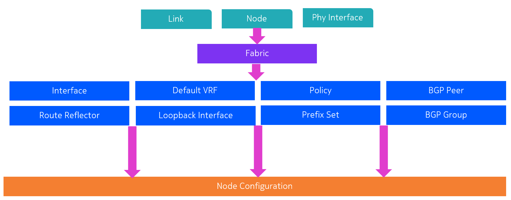
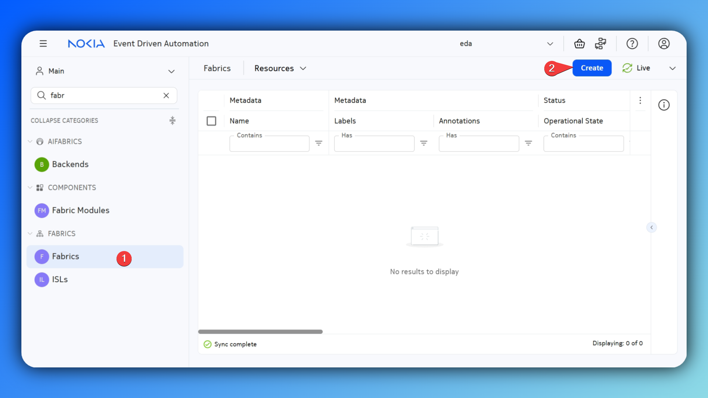
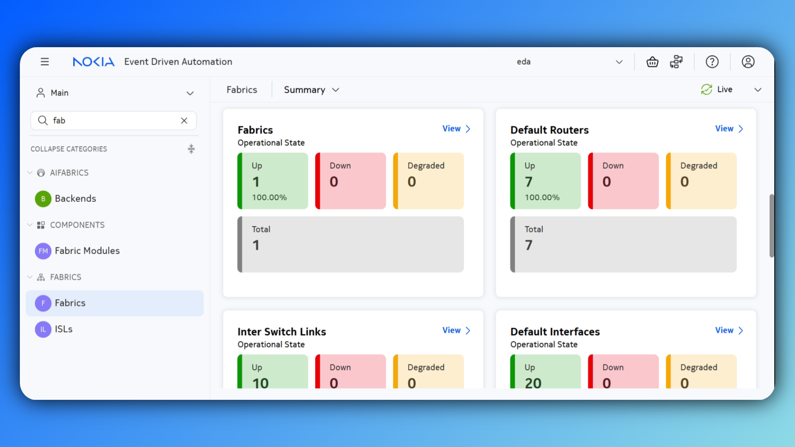
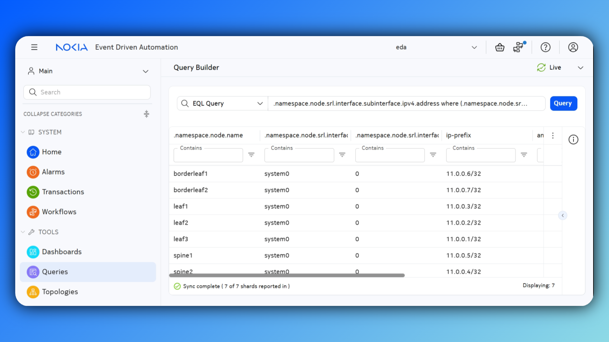
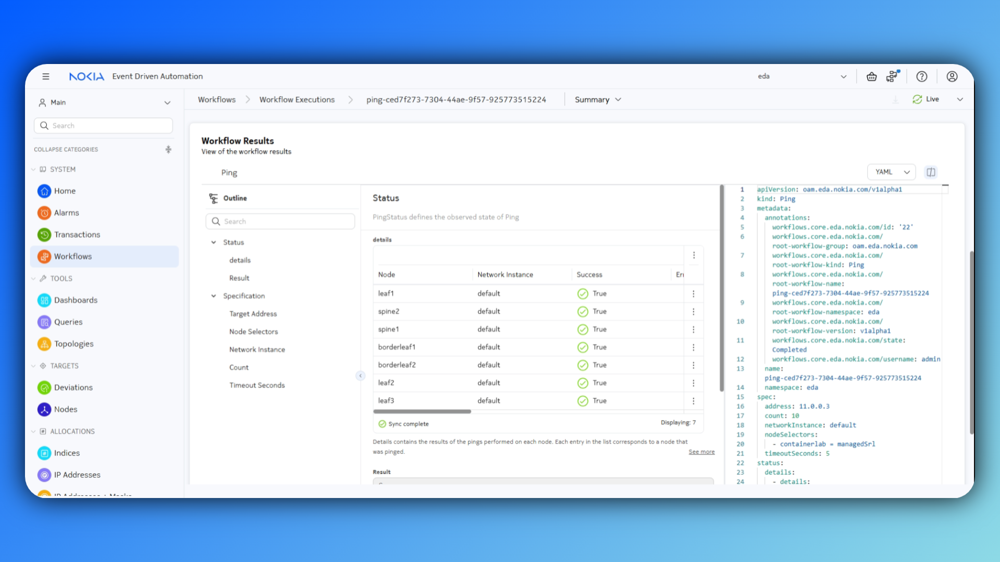

# Fabrics

<script type="text/javascript" src="https://viewer.diagrams.net/js/viewer-static.min.js" async></script>

|                       |                                                                                                                      |
| --------------------- | -------------------------------------------------------------------------------------------------------------------- |
| **Short Description** | Creating underlay connectivity and overlay control plane using the fabric resource                                                     |
| **Difficulty**        | Beginner                                                                                                             |
| **Topology Nodes**    | :material-router: spine1, :material-router: spine2, :material-router: leaf1, :material-router: leaf2, :material-router: leaf3, :material-router: borderleaf1, :material-router: borderleaf2           |

## Objective

In this exercise, we enable IP connectivity between the switches in our lab topology. This underlay network is the basis of our fabric. It provides connectivity and allows EVPN routes to be exchanged to build services.

## Technology explanation


Typically in a Data Center Fabric network, **BGP** is used as the de-facto routing protocol. The control plane is split into two functions, the underlay and the overlay network. 

### Underlay Network
The **underlay network** provides IP connectivity between the data center's servers and routers. Typically, **eBGP** is being used as routing protocol for its dependability and scalability.

-{{ diagram_file(path='../images/eda.drawio', title='Underlay Network', page=1, zoom=1.5) }}-

### Overlay Network
An **overlay network** is established using tunneling techniques to carry traffic over the underlay network. This makes an overlay network logically separate and independent from the addressing and protocols used in the underlay network. It also keeps the overlay networks logically separate from each other. Workloads that are connected to the same overlay network can send Ethernet or IP packets to each other, but not to workloads in other overlay networks. Typically, **iBGP** is used to distribute reachability information for the workload endpoints.

-{{ diagram_file(path='../images/eda.drawio', title='Overlay Network', page=2, zoom=1.5) }}-

### Building Fabrics using EDA

We will need to establish eBGP sessions between leafs and spines, and a full mesh of iBGP sessions to setup the underlay and overlay networks in our fabric. EDA will abstract the concept of a "fabric" and translate the user's input into node configuration.

When building a fabric, you need to be weary of many different things, ISL IP addresses, ASNs, routing policies, loopback IP addresses, etc. EDA will automatically allocate these parameters from a pool. However, if you want more control over these choices, this is still possible.

EDA is built on apps, the `Fabrics` app allows you to create a fabric, which on its turn will create multiple resources in other apps, which in its turn are translated into node configuration.


## Tasks

### Validate that no IP connectivity is present
In SR Linux, the underlay routing protocol is specified in the default network-instance. Therefore, the absolute minimum configuration required to build a fabric, is the default network-instance.

Login into one of the nodes and verify whether the default network-instance is configured.

/// details | Solution
    type: success

=== "Command"
    ```srl
    admin@leaf1# info network-instance default

    ```

=== "Expected Output"
    ```srl
    *EMPTY*
    ```
///
### Create a Fabric

Navigate to the fabrics app and create a new fabric resource.



Go through the form and build your fabric.

/// details | Hint
    type: tip

Make sure, when filling out the form, that you are using the appropriate **labels** to build your fabric resource efficiently.
-{{ diagram_file(path='../images/eda.drawio', title='Node role labels', page=3, zoom=1.5) }}-
```yaml
# <SNIP>
  borderLeafs:
    borderLeafNodeSelector:
      - eda.nokia.com/role=borderleaf
  leafs:
    leafNodeSelector:
      - eda.nokia.com/role=leaf
  spines:
    spineNodeSelector:
      - eda.nokia.com/role=spine
# <SNIP>
```
///

/// details | Hint
    type: tip

When selecting your inter-switch links (ISLs), you can allocate them to an address pool, or skip this entirely by using IPv6 unnumbered interfaces. This also saves you some IP addressing space.
```yaml hl_lines="5"
# <SNIP>
  interSwitchLinks:
    linkSelector:
      - eda.nokia.com/role=interSwitch
    unnumbered: IPV6
# <SNIP>
```
///

/// details | Solution
    type: success

It might be tricky to solve this challenge if you see EDA for the first time, so here is a solution:
```yaml
apiVersion: fabrics.eda.nokia.com/v1alpha1
kind: Fabric
metadata:
  name: my-fabric
  namespace: eda
spec:
  borderLeafs:
    borderLeafNodeSelector:
      - eda.nokia.com/role=borderleaf
  interSwitchLinks:
    linkSelector:
      - eda.nokia.com/role=interSwitch
    unnumbered: IPV6
  leafs:
    leafNodeSelector:
      - eda.nokia.com/role=leaf
  overlayProtocol:
    bfd:
      desiredMinTransmitInt: 1000000
      detectionMultiplier: 3
      enabled: true
      minEchoReceiveInterval: 1000000
      requiredMinReceive: 1000000
    bgp:
      autonomousSystem: 65000
      clusterID: '1'
      rrClientNodeSelector:
        - eda.nokia.com/role=leaf
        - eda.nokia.com/role=borderleaf
      rrNodeSelector:
        - eda.nokia.com/role=spine
    protocol: IBGP
  spines:
    spineNodeSelector:
      - eda.nokia.com/role=spine
  systemPoolIPV4: systemipv4-pool
  underlayProtocol:
    bfd:
      desiredMinTransmitInt: 1000000
      detectionMultiplier: 3
      enabled: true
      minEchoReceiveInterval: 1000000
      requiredMinReceive: 1000000
    bgp:
      asnPool: asn-pool
    protocol:
      - EBGP

```
///

/// details | Other fabric types
    type: info

You may have noticed that eBGP underlay / iBGP overlay is not the only option in our fabric abstraction. EDA allows you to build fabrics using eBGP, OSPFv2 and OSPFv3 on the underlay, and iBGP or eBGP on the overlay.
/// details | example: OSPFv2 underlay, iBGP overlay
    type: example
``` yaml
apiVersion: fabrics.eda.nokia.com/v1alpha1
kind: Fabric
metadata:
  name: my-fabric
  namespace: eda
spec:
  borderLeafs:
    borderLeafNodeSelector:
      - eda.nokia.com/role = borderleaf
  interSwitchLinks:
    linkSelector:
      - eda.nokia.com/role = interSwitch
    poolIPV4: ipv4-pool
  leafs:
    leafNodeSelector:
      - eda.nokia.com/role = leaf
  overlayProtocol:
    bfd:
      desiredMinTransmitInt: 1000000
      detectionMultiplier: 3
      enabled: true
      minEchoReceiveInterval: 1000000
      requiredMinReceive: 1000000
    bgp:
      autonomousSystem: 65000
      clusterID: '1'
      rrClientNodeSelector:
        - eda.nokia.com/role=leaf
        - eda.nokia.com/role=borderleaf
      rrNodeSelector:
        - eda.nokia.com/role=spine
    protocol: IBGP
  spines:
    spineNodeSelector:
      - eda.nokia.com/role = spine
  systemPoolIPV4: systemipv4-pool
  underlayProtocol:
    bfd:
      desiredMinTransmitInt: 1000000
      detectionMultiplier: 3
      enabled: true
      minEchoReceiveInterval: 1000000
      requiredMinReceive: 1000000
    protocol:
      - OSPFv2
```
///
/// details | example: eBGP underlay, eBGP overlay
    type: example

``` yaml
apiVersion: fabrics.eda.nokia.com/v1alpha1
kind: Fabric
metadata:
  name: my-fabric
  namespace: eda
spec:
  borderLeafs:
    borderLeafNodeSelector:
      - eda.nokia.com/role = borderleaf
  interSwitchLinks:
    linkSelector:
      - eda.nokia.com/role = interSwitch
    unnumbered: IPV6
  leafs:
    leafNodeSelector:
      - eda.nokia.com/role = leaf
  overlayProtocol:
    bgp: {}
    protocol: EBGP
  spines:
    spineNodeSelector:
      - eda.nokia.com/role = spine
  systemPoolIPV4: systemipv4-pool
  underlayProtocol:
    bfd:
      desiredMinTransmitInt: 1000000
      detectionMultiplier: 3
      enabled: true
      minEchoReceiveInterval: 1000000
      requiredMinReceive: 1000000
    protocol:
      - EBGP
    bgp:
      asnPool: asn-pool
```
///
///

### Validate underlay connectivity
#### Fabric summary dashboard
Most EDA applications are shipped with their dedicated dashboards. This way you can monitor your network's health in the blink of an eye.



#### Using EDA Workflows
EDA comes with a set of operational automation tools, defined in `Workflows`. In this scenario, we can use the `Check BGP` workflow to validate the default BGP peers and the `Ping` workflow to ping one of the system loopback addresses from all nodes to validate the underlay routing.

##### Check BGP
The only input required for the `Check BGP` workflow is the target node. Use a common label for all nodes to easily select all nodes in your topology in one go.

/// details | `Check BGP` Solution
    type: success

=== "`Check BGP` Workflow"
    ```yaml
    apiVersion: protocols.eda.nokia.com/v1
    kind: CheckDefaultBgpPeers
    metadata:
    name: checkdefaultbgppeers-c4ad2cea-6192-46f4-a4ff-ed292d6fbab8
    namespace: eda
    spec:
    nodeSelector:
        - containerlab=managedSrl
    ```
=== "Expected Result"
    
///

##### Ping
Identify the system loopback IP address using EQL. One of these addresses will serve as an input in the `Ping` workflow.
/// details | EQL solution
    type: success

=== "EQL"
    ```jq
    .namespace.node.srl.interface.subinterface.ipv4.address where (.namespace.node.srl.interface.name = "system0")
    ```
=== "Expected Output"
    
///

/// details | Workflow solution
    type: success

=== "Ping Workflow"
    This `Ping` workflow will ping the system0 loopback interface on leaf-1 from all nodes.
    ```yaml
    apiVersion: oam.eda.nokia.com/v1alpha1
    kind: Ping
    metadata:
    name: ping-ced7f273-7304-44ae-9f57-925773515224
    namespace: eda
    spec:
    count: 10
    timeoutSeconds: 5
    address: 11.0.0.3
    nodeSelectors:
        - containerlab = managedSrl
    networkInstance: default
    ```
=== "Expected Result"
    In the Workflow Results, you can inspect the ping details and statistics.

    
///

#### SR Linux CLI
EDA offers great observability features, but sometimes it can still be useful to use the CLI to assess the network's health.

##### Configuration inspection
Log into one of the nodes and inspect the running configuration using the `info <YANG PATH>` command.


=== "Command"
    ```srl
    admin@leaf1# info with-context network-instance default
    ```
=== "Expected Output"
    //// collapse-code
    ``` srl
        network-instance default {
            !!! EDA Source CRs: fabrics.eda.nokia.com/v1alpha1/Fabric/my-fabric
            type default !!! EDA Source CRs: fabrics.eda.nokia.com/v1alpha1/Fabric/my-fabric
            admin-state enable !!! EDA Source CRs: fabrics.eda.nokia.com/v1alpha1/Fabric/my-fabric
            description "fabric: my-fabric role: leaf" !!! EDA Source CRs: fabrics.eda.nokia.com/v1alpha1/Fabric/my-fabric
            router-id 11.0.0.3 !!! EDA Source CRs: fabrics.eda.nokia.com/v1alpha1/Fabric/my-fabric
            ip-forwarding {
                !!! EDA Source CRs: fabrics.eda.nokia.com/v1alpha1/Fabric/my-fabric
                receive-ipv4-check false
            }
            interface ethernet-1/31.0 {
                !!! EDA Source CRs: fabrics.eda.nokia.com/v1alpha1/Fabric/my-fabric
            }
            interface ethernet-1/32.0 {
                !!! EDA Source CRs: fabrics.eda.nokia.com/v1alpha1/Fabric/my-fabric
            }
            interface system0.0 {
                !!! EDA Source CRs: fabrics.eda.nokia.com/v1alpha1/Fabric/my-fabric
            }
            protocols {
                bgp {
                    admin-state enable !!! EDA Source CRs: fabrics.eda.nokia.com/v1alpha1/Fabric/my-fabric
                    autonomous-system 101 !!! EDA Source CRs: fabrics.eda.nokia.com/v1alpha1/Fabric/my-fabric
                    router-id 11.0.0.3 !!! EDA Source CRs: fabrics.eda.nokia.com/v1alpha1/Fabric/my-fabric
                    dynamic-neighbors {
                        !!! EDA Source CRs: fabrics.eda.nokia.com/v1alpha1/Fabric/my-fabric
                        interface ethernet-1/31.0 {
                            peer-group bgpgroup-ebgp-my-fabric
                            allowed-peer-as [
                                100
                            ]
                        }
                        interface ethernet-1/32.0 {
                            !!! EDA Source CRs: fabrics.eda.nokia.com/v1alpha1/Fabric/my-fabric
                            peer-group bgpgroup-ebgp-my-fabric
                            allowed-peer-as [
                                100
                            ]
                        }
                    }
                    ebgp-default-policy {
                        !!! EDA Source CRs: fabrics.eda.nokia.com/v1alpha1/Fabric/my-fabric
                        import-reject-all true
                        export-reject-all true
                    }
                    afi-safi evpn {
                        !!! EDA Source CRs: fabrics.eda.nokia.com/v1alpha1/Fabric/my-fabric
                        admin-state enable
                        multipath {
                            allow-multiple-as true
                            ebgp {
                                maximum-paths 64
                            }
                            ibgp {
                                maximum-paths 64
                            }
                        }
                        evpn {
                            rapid-update true
                        }
                    }
                    afi-safi ipv4-unicast {
                        !!! EDA Source CRs: fabrics.eda.nokia.com/v1alpha1/Fabric/my-fabric
                        admin-state enable
                        multipath {
                            allow-multiple-as true
                            ebgp {
                                maximum-paths 32
                            }
                            ibgp {
                                maximum-paths 32
                            }
                        }
                        ipv4-unicast {
                            advertise-ipv6-next-hops true
                            receive-ipv6-next-hops true
                        }
                    }
                    afi-safi ipv6-unicast {
                        !!! EDA Source CRs: fabrics.eda.nokia.com/v1alpha1/Fabric/my-fabric
                        admin-state enable
                        multipath {
                            allow-multiple-as true
                            ebgp {
                                maximum-paths 32
                            }
                            ibgp {
                                maximum-paths 32
                            }
                        }
                    }
                    preference {
                        !!! EDA Source CRs: fabrics.eda.nokia.com/v1alpha1/Fabric/my-fabric
                        ebgp 170
                        ibgp 170
                    }
                    route-advertisement {
                        !!! EDA Source CRs: fabrics.eda.nokia.com/v1alpha1/Fabric/my-fabric
                        rapid-withdrawal true
                        wait-for-fib-install false
                    }
                    group bgpgroup-ebgp-my-fabric {
                        admin-state enable
                        export-policy [
                            ebgp-isl-export-policy-my-fabric
                        ]
                        import-policy [
                            ebgp-isl-import-policy-my-fabric
                        ]
                        failure-detection {
                            enable-bfd true
                            fast-failover true
                        }
                        afi-safi evpn {
                            admin-state disable
                        }
                        afi-safi ipv4-unicast {
                            admin-state enable
                            ipv4-unicast {
                                advertise-ipv6-next-hops true
                                receive-ipv6-next-hops true
                            }
                        }
                        afi-safi ipv6-unicast {
                            admin-state enable
                        }
                    }
                    group bgpgroup-ibgp-rrclient-my-fabric {
                        !!! EDA Source CRs: fabrics.eda.nokia.com/v1alpha1/Fabric/my-fabric
                        admin-state enable
                        export-policy [
                            ibgp-export-policy-my-fabric
                        ]
                        import-policy [
                            ibgp-import-policy-my-fabric
                        ]
                        failure-detection {
                            enable-bfd true
                            fast-failover true
                        }
                        afi-safi evpn {
                            admin-state enable
                        }
                        afi-safi ipv4-unicast {
                            admin-state disable
                        }
                        afi-safi ipv6-unicast {
                            admin-state disable
                        }
                    }
                    neighbor 11.0.0.4 {
                        !!! EDA Source CRs: fabrics.eda.nokia.com/v1alpha1/Fabric/my-fabric
                        admin-state enable
                        description "Connected to system interface spine2-system0"
                        peer-as 65000
                        peer-group bgpgroup-ibgp-rrclient-my-fabric
                        afi-safi evpn {
                            admin-state enable
                        }
                        afi-safi ipv4-unicast {
                            admin-state disable
                        }
                        afi-safi ipv6-unicast {
                            admin-state disable
                        }
                        local-as {
                            as-number 65000
                        }
                        transport {
                            local-address 11.0.0.3
                        }
                    }
                    neighbor 11.0.0.5 {
                        !!! EDA Source CRs: fabrics.eda.nokia.com/v1alpha1/Fabric/my-fabric
                        admin-state enable
                        description "Connected to system interface spine1-system0"
                        peer-as 65000
                        peer-group bgpgroup-ibgp-rrclient-my-fabric
                        afi-safi evpn {
                            admin-state enable
                        }
                        afi-safi ipv4-unicast {
                            admin-state disable
                        }
                        afi-safi ipv6-unicast {
                            admin-state disable
                        }
                        local-as {
                            as-number 65000
                        }
                        transport {
                            local-address 11.0.0.3
                        }
                    }
                }
            }
        }
    ```
    ////

/// details | Transaction details
    type: info
Alternatively, you can also inspect the changes in EDA, by looking at the transaction details. This view will show all resources that were created when running your intent. Next to this, the actual translation to node config is also shown here.
///
##### State information
With SR Linux' CLI you can easily fetch state information from your node using the `info from state <YANG PATH>` command.
For example:
=== "Command"
    ```srl
    admin@leaf1# info with-context from state network-instance default protocols bgp oper-state
    ```
=== "Expected Output"
    ```srl
    network-instance default {
        protocols {
            bgp {
                oper-state up
            }
        }
    }
    ```
/// details | EDA Query Language
    type: info
Alternatively, you can also monitor the full network state in EDA using queries. The full YANG tree of state information is populated into the EDA state database as well. You can use EQL to query this database. The above example would equate to `.namespace.node.srl.network-instance fields [ oper-state ] where (name = "default")` in EQL.
///
##### Show commands
Instead of directly inspecting the raw state information, you can also use show commands in SR Linux. These present state information in a more human readable format.
=== "Command"
    ```srl
    admin@leaf1# show network-instance default protocols bgp neighbor
    ```
=== "Expected Output"
    ```srl
    -----------------------------------------------------------------------------------------------------------------------
    BGP neighbor summary for network-instance "default"
    Flags: S static, D dynamic, L discovered by LLDP, B BFD enabled, - disabled, * slow
    -----------------------------------------------------------------------------------------------------------------------
    -----------------------------------------------------------------------------------------------------------------------
    +-------------+-------------------+-------------+-----+-------+-----------+-----------+----------+-------------------+
    |  Net-Inst   |       Peer        |    Group    | Fla | Peer- |   State   |  Uptime   | AFI/SAFI |  [Rx/Active/Tx]   |
    |             |                   |             | gs  |  AS   |           |           |          |                   |
    +=============+===================+=============+=====+=======+===========+===========+==========+===================+
    | default     | 11.0.0.4          | bgpgroup-   | SB  | 65000 | establish | 3d:5h:47m | evpn     | [5/5/1]           |
    |             |                   | ibgp-       |     |       | ed        | :9s       |          |                   |
    |             |                   | rrclient-   |     |       |           |           |          |                   |
    |             |                   | my-fabric   |     |       |           |           |          |                   |
    | default     | 11.0.0.5          | bgpgroup-   | SB  | 65000 | establish | 3d:5h:47m | evpn     | [5/0/1]           |
    |             |                   | ibgp-       |     |       | ed        | :9s       |          |                   |
    |             |                   | rrclient-   |     |       |           |           |          |                   |
    |             |                   | my-fabric   |     |       |           |           |          |                   |
    | default     | fe80::1844:bff:fe | bgpgroup-   | DB  | 100   | establish | 3d:5h:47m | ipv4-    | [5/5/6]           |
    |             | ff:1%ethernet-    | ebgp-my-    |     |       | ed        | :15s      | unicast  | [0/0/0]           |
    |             | 1/31.0            | fabric      |     |       |           |           | ipv6-    |                   |
    |             |                   |             |     |       |           |           | unicast  |                   |
    | default     | fe80::1856:cff:fe | bgpgroup-   | DB  | 100   | establish | 3d:5h:47m | ipv4-    | [5/5/2]           |
    |             | ff:1%ethernet-    | ebgp-my-    |     |       | ed        | :14s      | unicast  | [0/0/0]           |
    |             | 1/32.0            | fabric      |     |       |           |           | ipv6-    |                   |
    |             |                   |             |     |       |           |           | unicast  |                   |
    +-------------+-------------------+-------------+-----+-------+-----------+-----------+----------+-------------------+
    -----------------------------------------------------------------------------------------------------------------------
    Summary:
    2 configured neighbors, 2 configured sessions are established, 0 disabled peers
    2 dynamic peers
    ```

/// details | EDA Dashboards
    type: info

As you know `show` commands display `state` information in a human readable manner. Similarly, in EDA, network-wide state information can be used to create and populate dashboards, as we saw in [Fabric summary dashboard](fabrics.md/#fabric-summary-dashboard).
///
##### Operational commands
SR Linux' CLI also has some operational command. For example, you can use `ping` to validate the route-table and check connectivity.
=== "Command"
    ```srl
    admin@leaf1# ping 11.0.0.2 network-instance default
    ```
=== "Expected Output"
    ```srl
    Using network instance default
    PING 11.0.0.2 (11.0.0.2) 56(84) bytes of data.
    64 bytes from 11.0.0.2: icmp_seq=1 ttl=63 time=3.29 ms
    64 bytes from 11.0.0.2: icmp_seq=2 ttl=63 time=3.40 ms
    64 bytes from 11.0.0.2: icmp_seq=3 ttl=63 time=3.05 ms
    64 bytes from 11.0.0.2: icmp_seq=4 ttl=63 time=3.52 ms
    ^CCommand execution aborted : 'ping 11.0.0.2 network-instance default '
    ```

/// details | EDA Workflows
    type: info

The same can be done using EDA workflows as we saw in [Using EDA Workflows](fabrics.md/#using-eda-workflows).
///

#### Third party tools
[Grafana dashboard](/core/httpproxy/v1/grafana/dashboard)
## Summary
In this exercise, you successfully created the underlay network in your Data Center Fabric, enabling connectivity between the different nodes.

- You created a Fabric resource which automatically triggered the creation of all components required to build your underlay connectivity.
- You validated the Fabric's deployment using Dashboards, EQL, Workflows and SR Linux CLI.

This exercise demonstrated the automation power of EDA when deploying Day 0 networks. It showcased the observability in EDA, and the ability to perform operational tasks.